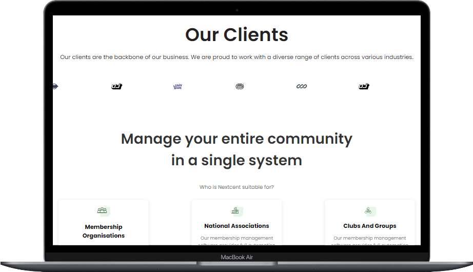

# My Website

THIS WEBSITE IS ONLY A FRONTEND PROJECT WITH NO BACKEND

## Introduction

This is a responsive website that provides The website includes a user-friendly interface and provides easy access


## Technologies Used

- React
- CSS3 
- JavaScript 


## Installation

Follow the steps below to set up the project locally:

1. Clone the repository:
    ```bash
        https://github.com/Derryblinks/Coded-Figma-UI-Website.git    ```

2. Navigate to the project directory:
    ```bash
    cd my-website
    ```

3. Install dependencies (if applicable):
    ```bash
    npm install
    ```

4. Run the development server (if applicable):
    ```bash
    npm start
    ```

## Usage

Once the project is installed, you can:

- Access the website by opening `index.html` in your browser or running the server in a development environment.


## Contributing

Contributions are welcome! To contribute:

1. Fork the repository.
2. Create a new branch (`git checkout -b feature-branch`).
3. Make your changes.
4. Commit your changes (`git commit -m 'Add some feature'`).
5. Push to the branch (`git push origin feature-branch`).
6. Open a pull request.


## Screenshots
<video width="600" controls>
  <source src="C:\Users\dboateng089\Downloads\REACT TUTORIALS\ReactTrials\my-app\src\assets\Screenshots\Macbook-Air-localhost-m9nmM3Unjm.webm" type="video/webm">
  Your browser does not support the video tag.
</video>
[text](src/assets/Screenshots/Macbook-Air-localhost-m9nmM3Unjm.webm)
.png>)
.png>)
.png>)
.png>)
.png>)



